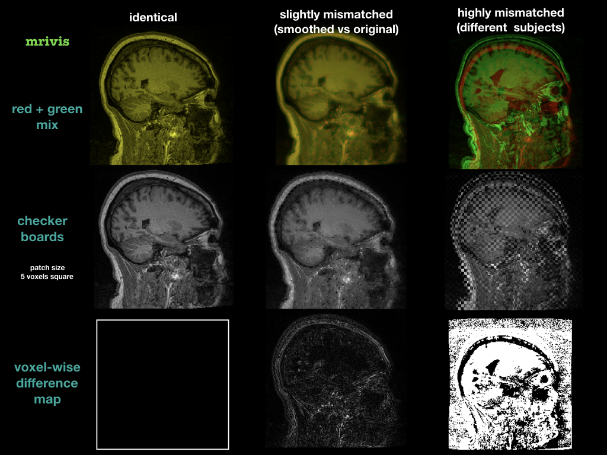
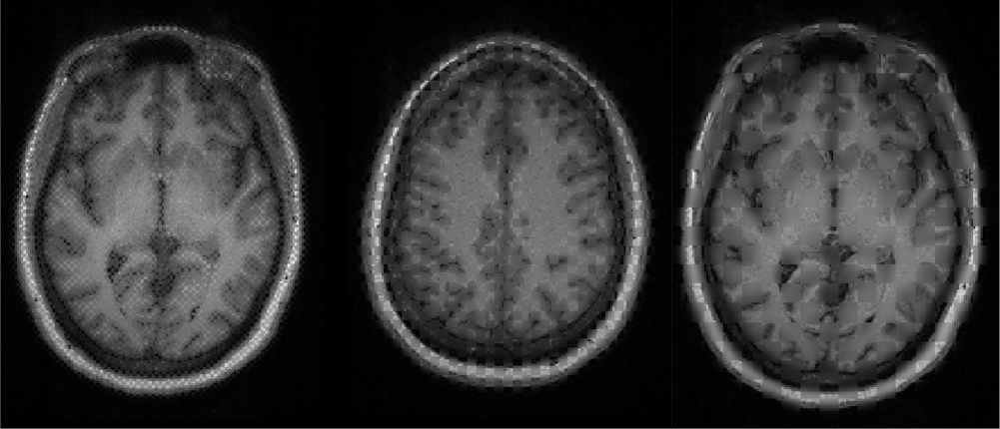
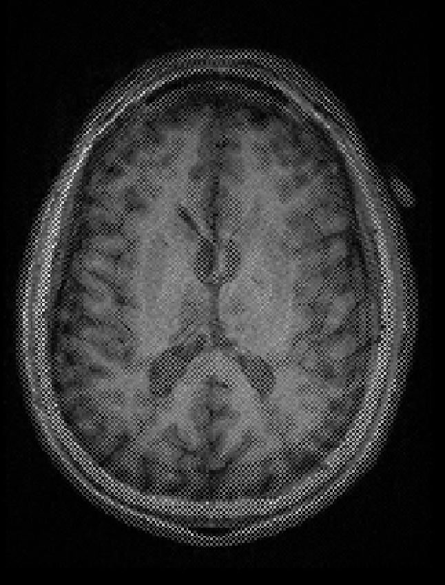
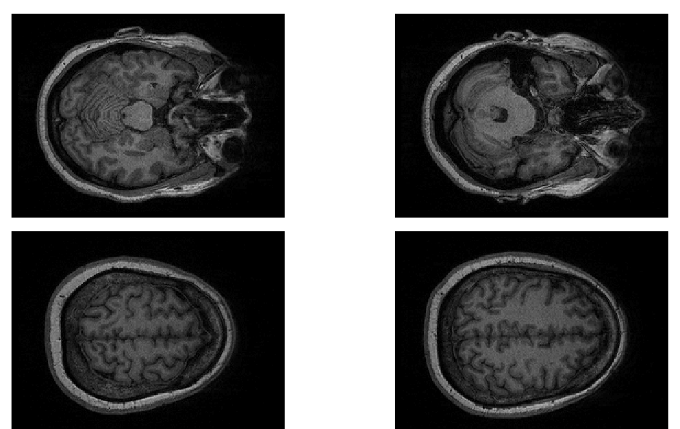

# mrivis

Tools for comparison of registration and spatial similarity of 3d MRI scans (T1, T2, PET etc) using checkerboard plots.


## Installation

```bash
pip install -U mrivis
```

## Usage:

```python
from mrivis import checkerboard, voxelwise_diff, red_green

path1 = '/Users/Reddy/Desktop/image.nii'
path2 = '/Users/Reddy/Desktop/another.nii'

checkerboard(path1, path2, patch_size=5) # square patches

checkerboard(path1, path2, rescale_intensity_range=(0, 256) )

checkerboard(path1, path2, patch_size=10,
             num_rows=1, num_cols=3) # 1 row per dimension, with 3 columns

checkerboard(path1, path2, patch_size=[10, 20], # rectangular patches
             num_rows=2, # 2 rows per dimension (6 rows in total)
             num_cols=5) # 5 panels per row

voxelwise_diff(path1, path2)
voxelwise_diff(path1, path2, abs_value=False)

red_green(path1, path2, alpha_channels=(1, 1))
red_green(path1, path2, alpha_channels=(0.7, 1))

```

## Various options available




## Sample outputs

When the two scans are mismatched:


When the mismatch is low (here a smoothed image is comapred to its original),
you can see the differences in intensity (due to smoothing),
but you can also see that they are both spatially aligned accurately:



With really low patch-sizes (e.g. 1, which is voxel-wise alternation), you can see the alignment even better:



When there is mismatch, you can clearly see it (patch size 15 voxels square):


Let's make the patches a bit bigger (patch size 25 voxels square):


Let's make the patches a even bigger (50 voxels square):


Let's use a **rectangular** patch (10 voxels high and 30 voxels wide):


If they were identical (no mismatch at all), you won't see any edges or borders:



Full layout with 6x6 pangels can be seen in [this folder](docs/comprehensive).

## More example outputs

Many more example outputs, for different combinations of parameters, can be seen in this [example outputs folder in docs](docs/example_outputs).


